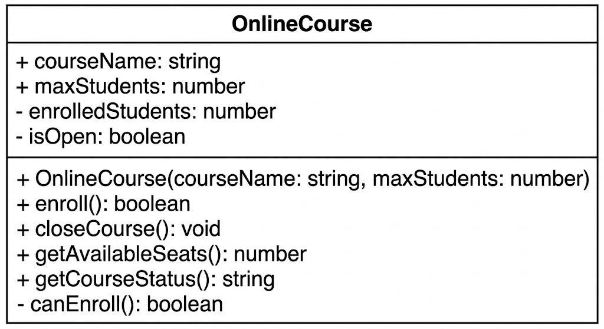

# TypeScript Quiz — ข้อ 4 (1 คะแนน)

## 🎯 คำสั่ง

ให้นักเรียนสร้าง class OnlineCourse ในไฟล์ `online-course.ts` ตาม **UML Class Diagram** ที่กำหนดให้
โดยต้องทำให้ไฟล์ `index.ts` ที่กำหนดให้ สามารถทำงานได้ถูกต้อง และได้ผลลัพธ์ตามที่คาดหวัง

## 📊 UML Class Diagram



> ⚠️ **สำคัญ**: ต้องอ่านและทำความเข้าใจ UML Class Diagram ให้ครบถ้วน

### รายละเอียด Class OnlineCourse

- **Attributes**:
  - `courseName` (string): ชื่อคอร์ส (public)
  - `maxStudents` (number): จำนวนนักเรียนสูงสุด (public)
  - `enrolledStudents` (number): จำนวนนักเรียนที่ลงทะเบียนแล้ว (private)
  - `isOpen` (boolean): สถานะของคอร์ส (private)

- **Constructor**:
  - รับค่า `courseName` และ `maxStudents` มากำหนดค่าเริ่มต้น
  - กำหนดค่าเริ่มต้น `enrolledStudents` เป็น 0 จะเพิ่มขึ้นเมื่อมีการลงทะเบียนเรียน
  - กำหนดค่าเริ่มต้น `isOpen` เป็น true จะปิดเมื่อมีการปิดคอร์สเรียน

- **Methods**:
  - `enroll()`: boolean
    - สำหรับลงทะเบียนเรียน
    - Return `true` ถ้าลงทะเบียนสำเร็จ, `false` ถ้าลงทะเบียนไม่สำเร็จ
  - `closeCourse()`: void
    - สำหรับปิดคอร์สเรียน
  - `getAvailableSeats()`: number
    - Return จำนวนที่นั่งที่เหลือ
  - `getCourseStatus()`: string
    - Return สถานะของคอร์ส ("Open" หรือ "Closed")
  - `canEnroll()`: boolean (private)
    - เช็คว่าสามารถลงทะเบียนได้หรือไม่

## 📌 หมายเหตุสำคัญ

**ในไฟล์ `index.ts` มี comment (`//`) ที่แสดงตัวอย่างผลลัพธ์ที่คาดหวัง**

ให้นักเรียนอ่านผลลัพธ์จาก comment เหล่านั้น แล้วเขียน method logic ใน class ต่างๆ ให้สอดคล้องกับผลลัพธ์ที่แสดงไว้

**ตัวอย่าง:**

```typescript
console.log(course.enroll());
// true
```

## 📝 หมายเหตุ

- ห้ามแก้ไขไฟล์ `index.ts`

```
📁 โครงสร้างไฟล์ที่ต้องมี
p04/
 ├── online-course.ts   ← นักเรียนต้องสร้าง
 └── index.ts  ← ไฟล์ที่กำหนดให้
```
