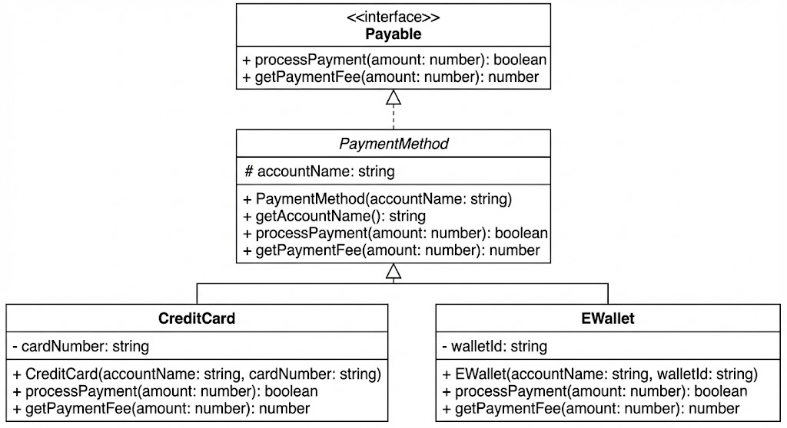

# TypeScript Quiz — ข้อ 5 (1 คะแนน)

## 🎯 คำสั่ง

ให้นักเรียนสร้าง **Interface และ Class** ตาม **UML Class Diagram** ที่กำหนดให้
โดยต้องทำให้ไฟล์ `index.ts` ที่กำหนดให้ สามารถทำงานได้ถูกต้อง และได้ผลลัพธ์ตามที่คาดหวัง

## 📊 UML Class Diagram



> ⚠️ **สำคัญ**: ต้องอ่านและทำความเข้าใจ UML Class Diagram ให้ครบถ้วน

### รายละเอียด

1. **Interface `Payable`**:
   - `processPayment(amount: number)`: boolean
   - `getPaymentFee(amount: number)`: number

2. **Class `PaymentMethod`**:
   - `accountName`: string (protected)
   - Constructor: รับ `accountName`
   - `getAccountName()`: string
   - ต้องสร้าง method หรือ logic ตามความเหมาะสม

3. **Class `CreditCard`**:
   - `cardNumber`: string (private)
   - Constructor: รับ `accountName`, `cardNumber`
   - `processPayment(amount: number)`: boolean
     - จำลองการตัดบัตร (ในที่นี้ให้ return true เสมอ)
     - **ต้องมีการ console.log ว่า Cutting credit card balance: {amount} Baht (amount คือจำนวนเงินที่ตัด)**
   - `getPaymentFee(amount: number)`: number
     - ค่าธรรมเนียม 2% ของยอดเงิน

4. **Class `EWallet`**:
   - `walletId`: string (private)
   - Constructor: รับ `accountName`, `walletId`
   - `processPayment(amount: number)`: boolean
     - จำลองการตัดเงิน (ในที่นี้ให้ return true เสมอ)
     - **ต้องมีการ console.log ว่า Cutting e-wallet balance: {amount} Baht (amount คือจำนวนเงินที่ตัด)**
   - `getPaymentFee(amount: number)`: number
     - ค่าธรรมเนียม 1% ของยอดเงิน

## 📌 หมายเหตุสำคัญ

**ในไฟล์ `index.ts` มี comment (`//`) ที่แสดงตัวอย่างผลลัพธ์ที่คาดหวัง**

## 📝 หมายเหตุ

- ห้ามแก้ไขไฟล์ `index.ts`

```
📁 โครงสร้างไฟล์ที่ต้องมี
p05/
 ├── payable.ts          ← Interface
 ├── payment-method.ts   ← Abstract Class
 ├── credit-card.ts      ← Class
 ├── ewallet.ts          ← Class
 ├── index.ts            ← ไฟล์ที่กำหนดให้
```
